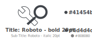

# iop-visual-identity

Logos, fonts and color schemes for the Internet of Production Alliance.

# Logo Style Guide

# Logo Variants

## Light With Text

[using font](logo/light/with-text-as-font/IOP-OKH-A.svg)

[using font](logo/light/with-text-as-font/IOP-OKW.svg)

[using font](logo/light/with-text-as-font/IOP-EC.svg)

## Light Without Text

## Dark Without Text

